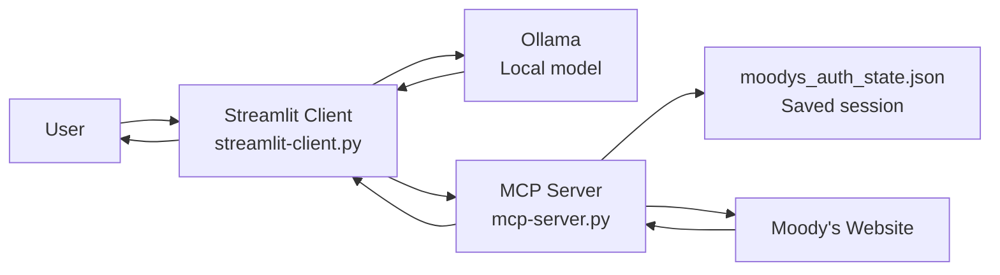
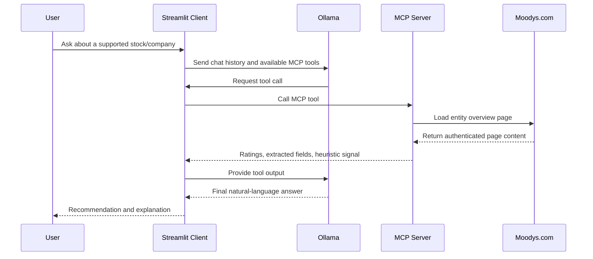

# Moody's Credit Tool

This project combines a local Ollama-powered chat UI with an MCP server that retrieves Moody's entity data and returns a simple stock recommendation signal such as `BUY`, `HOLD`, or `SELL`.

The tool is designed around a fixed mapping of supported stock/company names to Moody's internal entity IDs. Users should ask about one of the supported companies listed below.

## What This Project Contains

- `mcp-server.py`: MCP server that resolves a company name to a Moody's entity ID, loads Moody's pages, extracts rating data, and returns a heuristic recommendation.
- `streamlit-client.py`: Streamlit chat application that uses a local Ollama model and calls MCP tools when needed.
- `session-login.py`: Browser-based Moody's login helper intended to save authenticated session state.
- `moodys_auth_state.json`: Saved Moody's authentication/session file used by the MCP server.
- `requirements.txt`: Python dependencies for the project.

## Architecture



### Request Flow



## Prerequisites

- Python 3.10+ recommended
- `venv` support for Python virtual environments
- Ollama installed locally
- Playwright browser dependencies available on the machine
- A Moody's account with access to the relevant entity pages

## Setup

### macOS / Linux / WSL

#### 1. Create and activate a Python virtual environment

```bash
python -m venv .venv
source .venv/bin/activate
```

#### 2. Install Python packages

```bash
pip install -r requirements.txt
```

#### 3. Install Playwright browser binaries

```bash
python -m playwright install
```

### Windows PowerShell

#### 1. Create and activate a Python virtual environment

```powershell
python -m venv .venv
.venv\Scripts\Activate.ps1
```

#### 2. Install Python packages

```powershell
pip install -r requirements.txt
```

#### 3. Install Playwright browser binaries

```powershell
python -m playwright install
```

### 4. Install and prepare Ollama

Install Ollama from the official site:

- https://ollama.com/download

Then pull the model used by the client:

macOS / Linux / WSL:

```bash
ollama pull llama3.2
```

Windows PowerShell:

```powershell
ollama pull llama3.2
```

Make sure the Ollama application/service is running locally before starting the Streamlit app.

## Moody's Account and Session Setup

Before running the MCP server, create valid Moody's credentials and save an authenticated browser session.

### 1. Create a Moody's account

- Go to `https://www.moodys.com`
- Create your credentials or use an existing account with access to the Moody's entity pages needed by this project

### 2. Generate the Moody's session file

The project expects a session file named `moodys_auth_state.json`.

Intended flow:

macOS / Linux / WSL:

```bash
python session-login.py
```

Windows PowerShell:

```powershell
python session-login.py
```

Important note: the current `session-login.py` file defines the manual login function, but it does not invoke it automatically in a `__main__` block. If running the script does not open a browser, that file will need a small code update before this step works as written.

What the login step is intended to do:

- Open a Playwright browser window
- Let you log into Moody's manually
- Save the authenticated browser state to `moodys_auth_state.json`

### 3. Verify the session file exists

macOS / Linux / WSL:

```bash
ls -l moodys_auth_state.json
```

Windows PowerShell:

```powershell
Get-Item .\moodys_auth_state.json
```

If the file exists and is non-empty, the MCP server can use it for authenticated requests.

## Running the Project

Start the components in this order.

### 1. Start the MCP server

macOS / Linux / WSL:

```bash
source .venv/bin/activate
python mcp-server.py
```

Windows PowerShell:

```powershell
.venv\Scripts\Activate.ps1
python mcp-server.py
```

The Streamlit client expects the MCP endpoint at:

```text
http://127.0.0.1:8000/mcp
```

### 2. Start the Streamlit client

Open a second terminal, activate the same virtual environment, and run:

macOS / Linux / WSL:

```bash
source .venv/bin/activate
streamlit run streamlit-client.py
```

Windows PowerShell:

```powershell
.venv\Scripts\Activate.ps1
streamlit run streamlit-client.py
```

Streamlit will usually open at:

```text
http://localhost:8501
```

### 3. Interact with the chatbot

In the Streamlit UI:

- Ask about one supported company at a time
- The Ollama model can decide to call the MCP tool
- The MCP server fetches Moody's data for that company
- The UI returns the final recommendation and explanation

## Supported Companies

The Moody's lookup relies on internal entity IDs, so only companies already present in the mapping can be used.

Canonical supported companies in the current code:

- Amazon
- Netflix
- Apple
- Microsoft
- Alphabet / Google
- Meta / Facebook
- Tesla

Examples of accepted aliases currently present in `mcp-server.py` include:

- `amazon`, `amazon.com`, `amazon inc`
- `netflix`, `netflix inc`
- `apple`, `apple inc`
- `microsoft`, `microsoft corporation`
- `alphabet`, `google`, `google llc`
- `meta`, `facebook`, `meta platforms`
- `tesla`, `tesla inc`

If a company name is not found, add it to `COMPANY_ENTITY_MAP` in `mcp-server.py` with the correct Moody's entity ID.

## How the Recommendation Works

This project uses Moody's rating information plus a simple heuristic in the MCP server to produce a signal.

Important limitation:

- The output is a demo heuristic, not financial advice
- Moody's ratings are credit opinions, not direct equity recommendations

## Useful Files

- [mcp-server.py](/mnt/c/Users/franc/Documents/Learning/Interview Prep/Moodys/credit-tool/mcp-server.py)
- [streamlit-client.py](/mnt/c/Users/franc/Documents/Learning/Interview Prep/Moodys/credit-tool/streamlit-client.py)
- [session-login.py](/mnt/c/Users/franc/Documents/Learning/Interview Prep/Moodys/credit-tool/session-login.py)
- [requirements.txt](/mnt/c/Users/franc/Documents/Learning/Interview Prep/Moodys/credit-tool/requirements.txt)

## Troubleshooting

- If `streamlit-client.py` cannot connect, confirm `mcp-server.py` is already running.
- If Moody's pages do not load, verify `moodys_auth_state.json` exists and contains a valid session.
- If Playwright fails, rerun `python -m playwright install`.
- If Ollama requests fail, confirm Ollama is installed, running, and has the `llama3.2` model pulled locally.
- If the chatbot cannot find a company, use one of the supported names already mapped in `COMPANY_ENTITY_MAP`.
